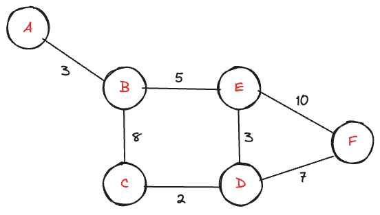
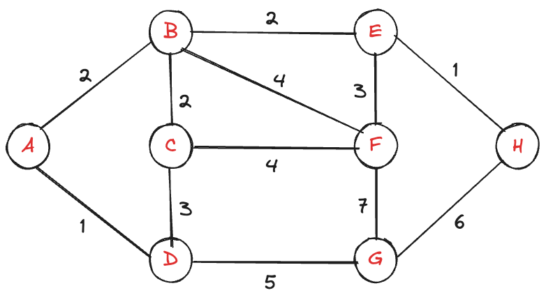
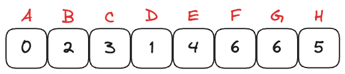

# 다익스트라 알고리즘 (Dijkstra)

**다익스트라 알고리즘(Dijkstra Algorithm)** 은 가중치 그래프에서 적용할 수 있는 알고리즘이다.

가중치가 없는 그래프일 경우에는 모든 가중치가 동일하다고 보고 최단 경로를 효율적으로 보지만, 가중치가 있는 그래프에서는 가중치를 계산했을 때 도착지점까지의 최소 비용이 드는 경로를 효율적인 경로라고 판단한다.



예를 들어, 가중치가 없을 때 D까지의 최단 경로는 A->B->E->D와 A->B->C->D는 차이가 없다.
하지만 가중치가 주어지고 최소 비용 경로는 A->B->E->D가 더 효율적이다.

이러한 가중치 문제를 해결하기 위해서 **다익스트라 알고리즘**을 사용한다.

> 다익스트라 알고리즘은 가중치 그래프에서 시작점과 도착점이 주어졌을 때, **최소 비용**을 return 하는 알고리즘

## 원리

1. 시작점의 라벨은 0, 나머지 점들을 ∞로 초기화
2. 사용 안 한 라벨 중 가장 작은 라벨을 찾고, 해당 라벨을 사용했다고 업데이트
3. 해당 점에 인접한 점들의 라벨들을 업데이트 (이미 라벨 되어 있는 값보다 작으면 그 값으로 업데이트하고, 크면 업데이트 X)
4. 2-3의 과정을 반복
5. 모든 라벨을 사용했으면 종료

## 우선순위 큐(Priority Queue)

일반적인 큐(Queue)는 선입선출(FIFO) 구조로 먼저 들어온 것이 먼저 나가는 구조인데, **우선순위 큐(Priority Queue)** 는 우선순위가 높은 것이 먼저 나가는 구조이다.

다익스트라는 가장 비용이 적은 노드부터 처리하기 때문에 우선순위 큐를 사용한다.

비용이 더 작은 것부터 처리해야 최소 비용 거리를 보장하기 때문이다.

## 구현

**방문할 수 있는 노드 중에 가장 비용이 낮은 곳 방문 (우선순위가 높은 곳 방문)**

1. 우선순위 큐에 시작노드 추가
2. 우선순위가 가장 높은 노드 추출
3. 방문 여부 확인
4. 비용 업데이트
5. 현재 노드와 연결된 노드 우선순위 큐에 추가
6. 목적지에 기록된 비용 반환

### 코드 구현

**예제 문제**


**그래프 구현**
`1` = `A` 로 해서 `H`까지 구현

```java
Map<Integer, List<Edge>> graph = new HashMap<>() {{
    put(1, List.of(new Edge(2, 2), new Edge(4, 1)));
    put(2, List.of(new Edge(3, 2), new Edge(5, 2), new Edge(6, 4)));
    put(3, List.of(new Edge(6, 4)));
    put(4, List.of(new Edge(7, 5)));
    put(5, List.of(new Edge(8, 1)));
    put(6, List.of(new Edge(5, 3)));
    put(7, List.of(new Edge(6, 7), new Edge(8, 6)));
    put(8, List.of());
}};
```

**노드, 가중치 저장**

```java
class Edge implements Comparable<Edge>{
	int node;
	int cost;

	Edge(int node, int cost){
		this.node = node;
		this.cost = cost;
	}

	@Override
	public int compareTo(Edge other){
		return this.cost - other.cost;
	}
}
```

**람다식으로 변환 가능**

```java

class Edge {
    int node, cost;
    Edge(int node, int cost) {
        this.node = node;
        this.cost = cost;
    }
}
Queue<Edge> pq = new PriorityQueue<>(Comparator.comparingInt(e -> e.cost));
```

**distance, heap 구현**

```java
final int INF = Integer.MAX_VALUE;
int[] distance = new int[graph.size() + 1];
Arrays.fill(distance, INF);

Queue<Edge> pq = new PriorityQueue<>();
pq.add(new Edge(start_node, 0));
distance[start_node] = 0
```

**업데이트 구현**

```java
while (!pq.isEmpty()) {
    Edge current = pq.remove();
    if (distance[current.node] < current.distance) continue;

    for (Edge next : graph.get(current.node)) {
        int newDist = distance[current.node] + next.distance;
        if (newDist < distance[next.node]) {
	        pq.add(new Edge(next.node, newDist));
            distance[next.node] = newDist;
        }
    }
}
```

**최종 코드**

```java
import java.util.*;

class Edge{
    int node, cost;
    public Edge(int node, int cost) {
        this.node = node;
        this.cost = cost;
    }
}

public class dijkstraExample {
    public static void main(String[] args) {
        // 그래프 초기화
        Map<Integer, List<Edge>> graph = new HashMap<>();

        graph.put(1, Arrays.asList(new Edge(2, 2), new Edge(4, 1)));
        graph.put(2, Arrays.asList(new Edge(5, 2), new Edge(3, 1), new Edge(6, 4)));
        graph.put(3, Arrays.asList(new Edge(6, 4)));
        graph.put(4, Arrays.asList(new Edge(3, 3), new Edge(7, 5)));
        graph.put(5, Arrays.asList(new Edge(8, 1)));
        graph.put(6, Arrays.asList(new Edge(5, 3)));
        graph.put(7, Arrays.asList(new Edge(6, 7), new Edge(8, 6)));
        graph.put(8, new ArrayList<>());

        int n = graph.size();
        // graph, 시작노드, 그래프 크기
        int[] result = dijkstra(graph, 1, n);
        System.out.println(Arrays.toString(result));
    }

    public static int[] dijkstra(Map<Integer, List<Edge>> graph, int start, int n) {
        // 초기설정
        int INF = Integer.MAX_VALUE;
        int[] distance = new int[n+1];
        Arrays.fill(distance, INF);

        // 시작점 예약
        Queue<Edge> pq = new PriorityQueue<>(Comparator.comparingInt(e -> e.cost));
        pq.add(new Edge(start, 0));
        distance[start] = 0;

        while (!pq.isEmpty()) {
            // 방문
            Edge current = pq.remove();
            if (distance[current.node] < current.cost) continue;
            // 다음 노드 예약
            for (Edge next : graph.get(current.node)) {
                int newDist = distance[current.node] + next.cost;
                if (newDist < distance[next.node]) {
                    pq.add(new Edge(next.node, newDist));
                    distance[next.node] = newDist;
                }
            }
        }
        return distance;
    }
}
```

**결과**



### 시간 복잡도

시간 복잡도는 우선순위 큐 + 인접 리스트에 결정된다.
노드 수 `V`, 간선 수 `E` 에 따라 시간이 증가한다.

> $O((V+E)\log V)$

## 활용

- 가중치 그래프에서 최소 비용 경로 구하기
- 확률 가중치로 가장 높은 확률의 경로 구하기

### 추천 문제

- 프로그래머스 Lv.3 [합승 택시 요금](https://school.programmers.co.kr/learn/courses/30/lessons/72413)
- 백준 1238번 [파티](https://www.acmicpc.net/problem/1238)
- LeetCode [Path with Maximum Probability](https://leetcode.com/problems/path-with-maximum-probability/description/)
- LeetCode [Network Delay Time](https://leetcode.com/problems/network-delay-time/)
