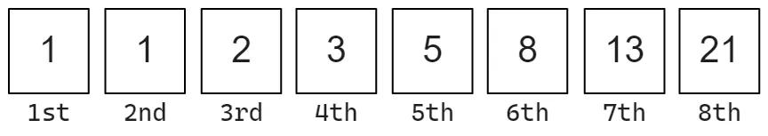
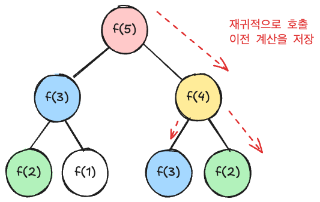
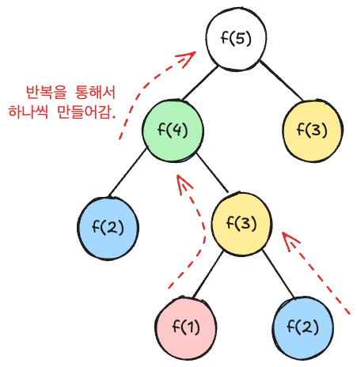

# 다이나믹 프로그래밍

>     다이나믹 프로그래밍(Dynamic Programming)은 큰 문제를 작은 문제들로 나누어 해결한 후 , 그 결과를 저장하여 중복 계산을 줄이는 최적화 기법을 말한다.

한글로 동적 프로그래밍이라고 말한다.

## 특징

1. **중복 계산 감소** : 이미 계산한 결과를 저장하고, 필요할 때마다 재활용하여 중복된 계산을 피한다.

2. **점화식**: 주어진 문제의 해를 작은 문제의 해를 통해 표현하는 식을 정의한다. 이를 점화식이라고 부른다.

3. **최적 부분 구조** : 큰 문제의 최적해가 작은 문제들의 최적해를 통해 구할 수 있어야 한다.

## 접근방법

#### 완전탐색(재귀)

1. 크고 복잡한 문제를 하위 문제로 나눈다.
2. 하위 문제에 대한 답을 구한다.
   - Overlapping Subproblem - 중복 하위 문제
   - Memonization - 계산 결과를 저장하여 중복된 문제에 사용
3. 하위 문제에 대한 답으로 원래 문제에 대한 답을 계산한다.

`DP`는 **기억하기 알고리즘**에 가깝다.
중복을 줄이고, 이전 값들을 기억하면서 필요할 때 호출해서 답을 구하기 때문!

#### 예시

**피보나치 수열**



피보나치 수열은 다음과 같이 $F(n) = F(n-1)+ F(n-2)$ $F(1) =1,$ $F(2)=1$인 수열

- 점화식(recurrence relation) : $F(n) = F(n-1)+ F(n-2)​$
- base case : $F(1) =1, F(2)=1​$

```java
int fibonacci(int n) {
    if (n == 1 || n == 2) {
        return 1;
    }
    return fibonacci(n - 1) + fibonacci(n - 2);
}
```

하지만 2개의 함수를 호출하기 때문에 $O(2^n)$ 의 시간 복잡도를 가지게 된다.
이러한 방법은 중복이 많이 발생하기 때문에 시간이 증가하게 되는데, 이러한 중복을 제거하는 방법을 찾아야 한다.
예를 들어, f(5)를 전에 계산 했으면, 후에 같은 과정으로 f(5)를 계산할 필요 없다. 이렇게 될 시, 시간 복잡도는 O(n)으로 획기적으로 줄 수 있게 된다.

```java
Map<Integer, Integer> memo = new HashMap<>();

int fibonacci(int n) {
    if (n == 1 || n == 2) {
        return 1;
    }
		if (!memo.containsKey(n)) {
				memo.put(n, fibonacci(n - 1) + fibonacci(n - 2));
		}
    return memo.get(n);
}
```

`HashMap`이 아닌 `dp[n]`과 같은 배열로도 만들 수 있다.

## Top-down

**Top-down 방식**은 하향식 방법으로 재귀적으로 접근하는 방식이다.

`f(n)`에서 `f(1)` 으로 접근하는 구조로, 재귀(recursive)로 구현하여 `memo`를 채워나가는 방식으로 구현된다.
이렇게 이전 결과를 저장, 메모하면서 채워나가는 것을 **메모이제이션(memoization)** 이라고 부른다.

위의 피보나치 수열의 코드가 바로 Top-down 방식으로 접근한 코드이다.

함수 호출이 반복되지 않도록 **캐시 배열(보통 `dp[]` 배열)** 에 저장.



## Bottom-up

**Botton-up 방식**은 상향식 방법으로 반복을 통해서 접근하는 방식이다.

`f(1)`에서 `f(n)`으로 접근하는 구조로, 반복을 통해서 가장 작은 것부터 큰 것으로 `memo`를 채워나가는 방식으로 구현된다.
이전 결과를 아래에서부터 만들기 때문에 값을 따로 저장할 필요없이 값을 만들면서 저장하면 된다. 이렇게 반복을 통해서 더 상위의 값을 만들어가는 과정을 **tabulation**이라고 한다.



#### 피보나치 수열 Bottom-up 방식

```java
Map<Integer, Integer> memo = new HashMap<>();

int fibonacci(int n) {
    memo.put(1, 1);
    memo.put(2, 1);
    for (int i = 3; i <= n; i++) {
        memo.put(i, memo.get(i - 1) + memo.get(i - 2));
    }
    return memo.get(n);
}
```

## Top-down vs. Bottom-up

접근 방식이 조금 다를 뿐, 문제 해결 자체는 동일하다.

`Top-down` 방식이 불필요한 계산을 막지만, 재귀적인 호출이 있어 시간이 조금 더 걸릴 수도 있다. 만약, 점화식을 빠르게 떠올릴 수 있으면 `Bottom-up`방식이 더 유용할 수 있다. 하지만 `Top-down`이건, `Bottom-up`이건 문제 해결을 위한 점화식을 작성해야 하는 것이 매한가지이기 때문에 둘 다 적절하게 사용할 수 있으면 좋다.

문제가 재귀적으로 정의됐을 경우에는 `Top-down`, 모든 하위문제가 필요하거나 스택 제한이 있을 경우에는 `Bottom-up`으로 푸는 것을 추천한다.

## 활용

- 최적화 문제
- 중복되는 부분 문제 (같은 하위 문제가 여러 번 반복)

### 추천 문제

- LeetCode [Coin Change](https://leetcode.com/problems/coin-change/description/)
- LeetCode [Climbing Stairs](https://leetcode.com/problems/climbing-stairs/)
- LeetCode [Longest Increasing Subsequence](https://leetcode.com/problems/longest-increasing-subsequence/)
- LeetCode [House Robber](https://leetcode.com/problems/house-robber/)
