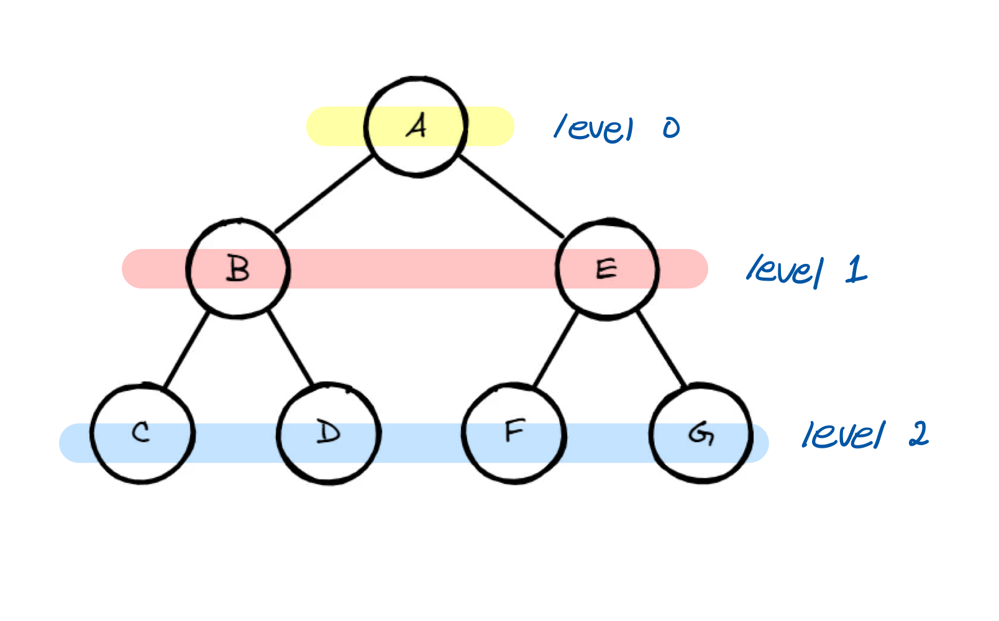
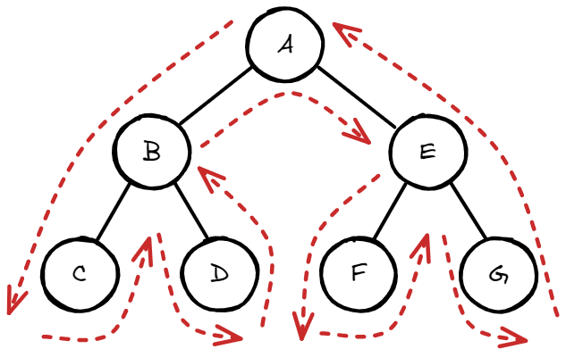

# 트리 (Tree)

트리(Tree)는 노드들이 계층적으로 연결된 비선형 자료구조로, 루트 노드와 부모-자식 관계의 서브트리들로 구성된다,
트리는 재귀적으로 정의된다.
트리에서는 DFS가 쓰이는 경우가 좀 더 많다.

## 용어

- **노드 (Node)**: 트리의 각 요소를 말하며, 데이터(값)와 포인터(자식 노드를 가리키는 링크)를 포함한다.
- **간선 (Edge)**: 노드와 노드를 연결하는 선으로, 부모와 자식 노드 간의 관계를 나타냄
- **루트 노드(Root Node)**: 트리의 최상위 노드, 부모 노드가 없다. 트리는 하나의 루트 노드만 가질 수 있다.

- **부모 노드(Parent Node)**: 트리 구조에서 다른 노드(자식 노드)를 가리키고 연결을 유지하는 상위 노드

- **자식 노드(Child Node)**: 부모 노드로부터 파생된 하위 노드

- **서브트리(Subtree)**: 특정 노드를 루트로 하는 트리의 부분 구조

- **형제 노드(Sibling)**: 같은 부모를 가지는 노드

- **리프 노드(Leaf Node)**: 자식 노드가 없는 노드로, 트리의 끝 부분에 위치함.

- **높이 (height)** : 루트 노드에서 가장 멀리 있는 리프 노드까지의 거리, 깊이의 최대값

- **레벨(Level)**: 트리에서 특정 노드의 깊이, 루트 노드는 레벨이 0

- **차수 (degree)**: 각 노드가 갖는 자식의 수. 모든 노드의 차수가 n개 이하인 트리를 n진 트리라고 한다.

## 트리의 특징

**그래프** : 트리는 방향성 비순환 그래프 (DAG, Directed Acyclic Graph)의 일종으로 볼 수 있습니다.

**간선의 수** : 기본적으로 트리의 크기가 N일 때, 전체 간선의 개수는 N-1개이다.

**방향성** : 트리는 부모 -> 자식(위에서 아래)으로 방향성이 존재한다.

## 트리 순회 (Tree Traversal)

트리 자료구조에 포함된 노드를 특정한 방법으로 한 번씩 방문하는 방법

선형구조인 배열과 리스트는 `for`문을 통해서 쉽게 순회할 수 있지만, 트리는 비선형 구조이기 때문에 순회하는 방법이 존재한다.

대표적인 순회방법은 다음과 같다.

1. BFS (lever order)
2. DFS (pre-order, in-order, post-order)

### 1. BFS (Lever-order)

`level`은 `root`에서 떨어진 거리

level-order는 level 별로 순회하는 것



레벨 순회는 `A` -> `B, C, D` -> `E, F, G, H` -> `I` 순서로 진행

BFS(너비 우선 탐색)을 기반으로, 큐(Queue)를 사용하여 구현한다.

**순회 구현**

```java
List<Integer> bfs(Node root) {
    if (root == null) return Collections.emptyList();

    List<Integer> result = new ArrayList<>();
    Queue<Node> q = new LinkedList<>();
    q.add(root);  // 루트 노드를 큐에 삽입

    while (!q.isEmpty()) {
        Node curNode = q.remove();  // 큐에서 노드를 꺼냄
        result.add(curNode.value);  // 방문(출력/저장/연산)

        // 왼쪽 자식이 있으면 큐에 넣음
        if (curNode.left != null) {
            q.add(curNode.left);
        }
        // 오른쪽 자식이 있으면 큐에 넣음
        if (curNode.right != null) {
            q.add(curNode.right);
        }
    }

    return result;
}
```

**시간 복잡도**

- 각 노드를 큐에 삽입하고 제거하는 연산은 $O(1)$
- 노드가 $n$개일 때, 모든 노드를 한 번씩 방문하므로 전체 연산은 $O(n)$ 시간이 소요

---

### 2. DFS (pre-order, in-order, post-order)

시작 노드에서 왼쪽 자식 노드, 다시 시작 노드를 거친 후 오른쪽 자식 노드를 찍고 마지막으로 시작노드를 가는 것

- 전위 순회 (pre-order) : 루트를 먼저 방문
- 중위 순회 (in-order) : 왼쪽 자식을 방문한 뒤에 루트를 방문
- 후위 순회 (post-order) : 오른쪽 자식을 방문한 뒤에 루트를 방문



**순회 구현**

```java
void traversal(Node root) {
		if (root == null) {
				return;
		}
		traversal(root.left);
		traversal(root.right);
}
```

언제 방문할 지에 따라 전위, 중위, 후위의 코드가 결정됨

```java
// 1. 전위 순회(Pre-order)
void preorder(Node root) {
		if (root == null) {
				return;
		}
		System.out.println(root);
		preorder(root.left);
		preorder(root.right);
}

// 2. 중위 순회(In-order)
void inorder(Node root) {
		if (root == null) {
				return;
		}
		inorder(root.left);
		System.out.println(root);
		inorder(root.right);
}

// 3. 후위 순회(Post-order)
void postorder(Node root) {
		if (root == null) {
				return;
		}
		postorder(root.left);
		postorder(root.right);
		System.out.println(root);
}
```

출력

1. A B C D E F G
2. C B D A F E G
3. C B D A F E G

**전위, 중위, 후위 순회 시간복잡도**

> 재귀의 시간복잡도 = 재귀 함수 호출 수 x (재귀 함수 하나당) 시간복잡도

- 재귀 함수 호출 수 : $n$
- 재귀 함수 하나당 시간 복잡도 : $O(n)$
  -> 전위, 중위, 후위 순회의 시간 복잡도 = $O(n)$
