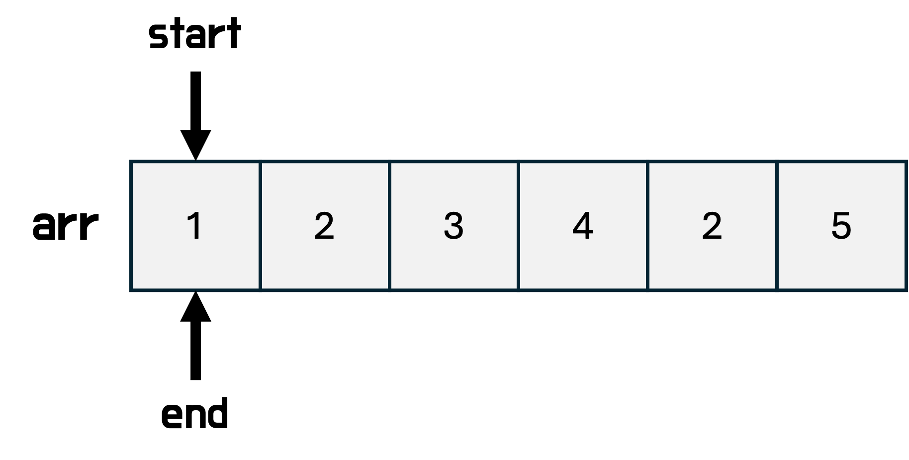
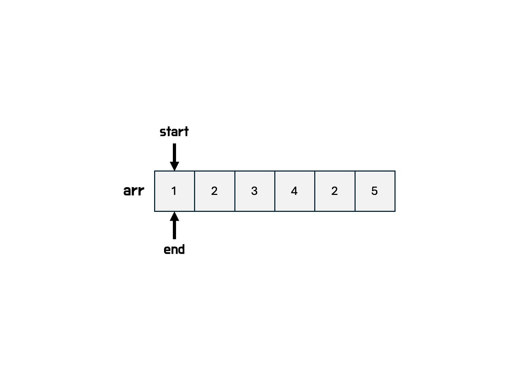

# 투 포인터(Two Pointer)

투 포인터(Two Pointer)는 **리스트(배열)**에서 두 개의 포인터를 이용해 조건을 만족하는 구간이나 값을 효율적으로 탐색하는 알고리즘이다.

서로 다른 두 개의 포인터를 이동시키며 문제의 조건을 만족하는 부분을 탐색한다.

주로 정렬된 배열에서 구간합, 쌍(pair), 부분 수열 등을 찾을 때 사용된다.

투 포인터 사용의 가장 큰 장점은 시간복잡도 $O(n^2)의 문제를 $O(n)으로 해결할 수 있다는 점이다.



## 배열 기반 (Array-based)

배열의 양 끝이나 시작점에서 출발하는 두 개의 포인터(start, end)를 이동시킨다.
일반적으로 `while(start <= end)` 혹은 `while(end < n)` 같은 조건으로 순회한다.

- 조건에 따라 한 쪽 포인터만 이동시키거나
- 두 포인터를 동시에 이동시키며
- 특정 조건을 만족하는 부분만을 탐색

### 동작 방식

- 정렬이 되어 있어야 하는 경우가 많다.

- 보통 **슬라이딩 윈도우 기법**과 함께 사용되기도 한다.

1. 시작 포인터와 끝 포인터를 초기화 (start = 0, end = 0)

2. 조건(`sum < k`)을 만족하면 결과를 갱신하고 포인터를 이동

3. 조건을 만족하지 않으면 포인터를 다르게 이동

4. 범위를 벗어날 때까지 반복



## 코드 구현

```java
import java.util.Arrays;

public class TwoPointerExample {
    public static void main(String[] args) {
        int[] arr = {1, 2, 3, 4, 2, 5};
        int k = 7;

        int start = 0, end = 0, sum = 0;
        int minLength = Integer.MAX_VALUE;
        int[] result = new int[0];

        while (end < arr.length) {
            sum += arr[end];

            while (sum >= k) {
                if (sum == k && (end - start + 1) < minLength) {
                    minLength = end - start + 1;
                    result = Arrays.copyOfRange(arr, start, end + 1); // 부분수열 저장
                }
                sum -= arr[start++];
            }
            end++;
        }

        System.out.println(Arrays.toString(result)); // 출력 : [3, 4]
    }
}
```

## 활용 예시

- **부분 합**이 특정 값을 만족하는 가장 짧은 연속 부분 수열 찾기
- **합이 K인 두 수의 쌍** 찾기
- **슬라이딩 윈도우** 최댓값, 평균 등

### 추천 문제

- [수들의 합5 - 백준 2018](https://www.acmicpc.net/problem/2018)
- [연속된 부분 수열의 합 - 프로그래머스](https://school.programmers.co.kr/learn/courses/30/lessons/178870)
