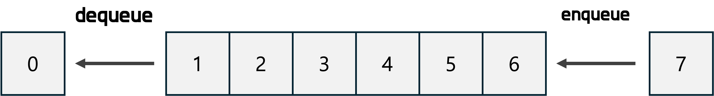

# 큐 (Queue)

Queue(큐)는 데이터를 저장하는 **선형 자료구조**로, **선입선출(FIFO, First In First Out)** 방식을 따른다.
즉, 먼저 저장된 데이터가 먼저 처리된다.

## 선입선출(FIFO)

먼저 들어온 데이터가 먼저 처리되는 구조
큐 = 웨이팅 줄서기
먼저 줄을 선 사람이 먼저 들어가는 구조라고 생각하면 됨.


- enqueue(): 데이터를 큐의 뒤(rear)에 추가하는 작업
- dequeue(): 큐의 앞(front)에서 데이터를 꺼내는 작업

## Queue 사용방법

`Queue` 인터페이스를 구현해서 사용

### Linked List 기반 Queue 구현

`LinkedList`는 연결 리스트를 구현한 클래스로, 큐로도 사용할 수 있다. (양방향 리스트)

```java
Queue<T> q = new LinkedList<>(); // T: 타입파라미터
```

### Deque(double-ended queue) 기반 Queue 구현

`ArrayDeque`은 양쪽 끝에서 삽입, 삭제가 가능한 덱(deque) 자료구조를 dynamic array 방식으로 구현한 것으로, 투 포인터를 이용해서 앞부분의 삽입, 삭제를 O(1) 시간복잡도로 수행할 수 있다.

```java
Queue<T> q = new ArrayDeque<>();
```

일반적으로 ArrayDeque이 다른 클래스에 비해 빠름

## Queue 사용법

`Queue` 인터페이스를 이용한 큐의 사용법
**Queue의 선언**
`q`라는 이름의 Integer 타입을 저장하는 Queue 선언

```java
Queue<Integer> q = new ArrayDeque<>();
// 또는
Queue<Integer> q = new LinkedList<>();
```

**Queue의 연산**

1. `add` : Queue에 원소 삽입 - enqueue
2. `poll` : Queue의 맨 앞 원소값 반환 (제거 O) - front
3. `peek` : 가장 앞에 있는 원소값을 읽기만 함. (제거X) - front
4. `remove` : Queue에서 원소 제거 - dequeue
5. `isEmpty()` : q가 비어있는지 확인

```java
// enqueue O(1)
q.add(1);
q.add(2);
q.add(3);
// 또는
// q.offer(3);

// front O(1)
q.poll(); // 1

// dequeue O(1)
q.remove(); // q: [2, 3]
q.remove(); // q: [3]

q.isEmpty();
```

## 활용예시

- Queue - BFS 구현

  그래프 탐색 방식 중 하나인 BFS(Breadth-First Search)에서 queue는 핵심적인 역할.

  BFS는 특정 정점에서 시작해, **현재 정점에 인접한 정점들을 큐에 저장**하고, 큐의 **front**에서 데이터를 dequeue하면서 모든 정점을 방문한다.

- Queue - 투 포인터 사용

  **투 포인터(Two Pointer)** 알고리즘은 **두 개의 포인터 위치를 기록**하여 효율적으로 문제를 해결하는 방식

  큐를 활용하면 투 포인터 알고리즘을 보다 쉽게 구현 가능

  - 해당 예시의 대표적인 문제 - 2022 카카오 기술 인턴십의 [두 큐의 합 같게 만들기](https://school.programmers.co.kr/learn/courses/30/lessons/118667)
