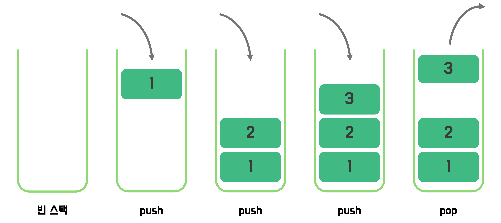

# 스택 (Stack)

스택(Stack)은 데이터를 저장하는 선형 자료구조로, **후입선출(LIFO, Last In First Out) 방식**을 따른다.

## 후입선출(LIFO)

가장 나중에 추가된 데이터가 가장 먼저 처리되는 구조

스택 = 프링글스

가장 나중에 넣은 과자를 가장 먼저 꺼내는 거랑 비슷함.


- **Push** : 데이터를 스택의 맨 위(top)에 추가
- **Pop** : 데이터를 스택의 맨 위(top)에서 제거하고 반환

## 스택 사용 방법

### Stack 클래스

`Stack` 클래스는 스택 자료구조를 구현한 클래스
하지만 `Deque` 인터페이스와 `ArrayDeque`을 사용하는 방식에 비해 성능적으로 떨어져 잘 사용하지 않음.

스택 대신에 Deque(덱)을 많이 이용

### Linked List 기반 Stack 구현

`LinkedList`는 양방향 연결 리스트이므로 스택으로 사용 가능

```java
// <T> 타입 파라미터
Deque<T> q = new LinkedList<>();
```

### Deque(double-ended queue) 기반 Stack 구현

`ArrayDeque` 역시 양쪽에서 삽입, 삭제가 가능하므로 스택으로 활용할 수 있다.

큐로 사용할때와 마찬가지로 다른 클래스들에 비해 가장 좋은 성능을 보여준다.

```java
Deque<T> q = new ArrayDeque<>();
```

## Stack의 사용법

**stack의 선언**

- `s`라는 이름의 `Integer` 타입을 저장하는 stack 선언
  ```java
  Deque<Integer> s = new ArrayDeque<>();
  // 또는
  Deque<Integer> q = new LinkedList<>(); // queue로도 사용가능
  ```

stack의 연산

1. `push` : stack에 원소 삽입
2. `peek` : stack의 최상위(마지막으로 들어온) 데이터 반환
3. `pop` : stack에 원소 제거
4. `isEmpty()` : stack이 비어있는지 확인

```java
s.push(1); // s : [1]
s.push(2); // s : [1, 2]
s.push(3); // s : [1, 2, 3]

s.peek(); // 3

s.pop(); // s : [1, 2]
s.pop(); // s : [1]

s.isEmpty() // false (비어있으면 true)

```

## 활용예시

- 짝 맞추기

  1. 유효 괄호 쌍 검사
  2. 동일 블록 제거하기

- 재귀
  스택은 재귀의 동작 원리와 밀접함.

  재귀 함수는 함수 내에서 **자기 자신을 호출**하여 반복 작업을 수행

  재귀가 호출될 때마다 함수는 새로운 스택 프레임(stack frame)을 생성하여 현재 상태를 저장하고, 재귀 호출이 종료되면 이전 상태로 복귀한다.

  이를 스택 관점에서 보면

  1. **재귀 호출**: 새로운 스택 프레임이 생성되고, 함수 상태가 스택에 push
  2. **함수 종료**: 스택에서 마지막에 저장된 상태가 pop되어 이전 상태로 복귀
     ⠀따라서 재귀 함수는 **스택 구조와 동일한 방식**으로 동작
